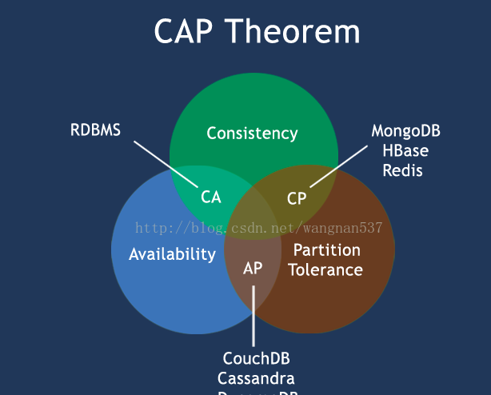

# distributed_system
深入理解分布式系统，CAP原则，RAFT协议，与Alibaba Nacos 源码核心解读

Raft: In Search of an Understandable Consensus Algorithm

在很多科学中都存在一种三元悖论，即一个系统不可能同时满足三个条件。
如经济学中的`蒙代尔不可能三角`。
在计算机科学中也有着类似的原则, 比如说`CAP原则`.

`CAP原则`：
    指的是在一个分布式系统中，分布式系统的可用性，一致性和分区容错性，三者只可以取其二，不可能通知满足三个要求。
    或者是，在分布式系统中，在满足分区容错性的前提下，系统的可用性，或者一致性只可以取其一。

下面会逐步的解释CAP原则，和对应的解决方案 即`RAFT协议`。
同时会学习一下工业界是如何一步步将RAFT应用到中间件的。

## 简要介绍：
 相对于Paxos算法，Raft的最大的好处就是简化了中间很多的状态。
（1）Raft把文案分解为三个子问题，分别是
    > 领导者选举 Leader Election
    > 日志复制与两阶段提交 Log Replication and Two Phase Commit
    > 安全性与极端问题的解决（如集群脑裂）
（2）Raft状态机做了简化。
    总共只包含三个状态，分别是，Follower，Candidate，Leader。
    每一个服务节点分别在这三个状态之间进行切换。
   