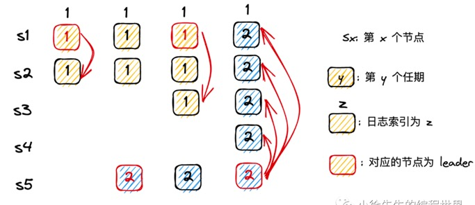

## 是否一项proposal只需要被多数派通过就可以提交？

 
 
 
背景：集群中存在 s1-s5 5 个节点，只需要 3 个节点达成共识，即可形成多数派.

（1）moment1：此时 leader 为 s1，term 为 1，s1 接受了一笔写请求，刚将其同步到 s1、s2，还未形成多数派时，s1 就宕机了；

（2）moment2：s5 收获了 s3、s4、s5 的选票，当选 leader，接受了一笔写请求，只在本机完成预写日志的落盘就宕机了；

（3）moment3：s1 收获了 s1、s2、s3、s4 的选票，重新当选 leader，继续推进 term = 1 时那笔遗留写请求的提交，
成功将其同步到了 s1、s2、s3，获得多数派的认同，于是提交这笔写请求. 提交之后，s1 又宕机了.

（4）moment4：s2 由于遗留了一笔 term 为 2 的日志 term，领先集群所有节点，因此可以收获集群所有节点的选票.
 于是 s5 再度当选 leader，继续推进 term 为 2 时遗留的写请求，由于这笔日志的 index 与第（3）步中 s1 同步日志的 index 相同，
 又因为其 term 值更大，最终会覆盖 s1、s2、s3 中的老日志，这就导致一笔已经被 s1 提交的日志最终被 s5 回滚了.

于是为解决这一问题，raft 算法中新增了一项限制，`新上任的 leader 需要至少完成一笔本任期内的写请求`，才能够执行提交动作.

补充这一设定后，在上述 case 的第（3）步，leader s1 尽管完成了 term 1 遗留日志的同步，也不能执行提交动作.
 直到其完成一笔 term 3 的写请求之后，才能执行老日志的提交. 这是因为此时，集群中的多数派已经被同步了 term 3 的日志，
 即使 s1 再发生宕机情况，s5 也不可能凭借 term2 的遗留日志而重新当选了.

事实上，在工程实践上，通常每个 leader 上任之后，都会向集群广播同步一笔内容为空的日志，称之为 `no-op`. 
只要这个请求被提交了，多数派也就写入了一遍当前任期的日志，于是本小节所谈及的异常问题就不可能再发生了.

## 如何解决网络分区引发的无意义选举问题？

倘若集群产生网络分区，部分处于小分区的节点由于无法接收到 leader 的心跳，导致进入选举流程. 
又因为网络分区问题，导致选举始终无法获得多数派的响应，最终 candidate 会无限自增 term. 
直到网络恢复的那一刻，由于 candidate 异常的高 term，导致 leader 退位，集群进入新一轮的选举流程.

尽管小分区中的节点由于数据的滞后不可能在选举中胜出，最后必然是大分区中的节点胜任，节点数据的一致性依然可以得到保证. 
但是这个无意义的选举过程同样会导致集群陷入暂不可用的阶段. 因此，我们可以通过这样的措施来避免这类无意义的选举：

`Pre-Vote Rpc`

每个 candidate 发起真实选举之前，会有一个提前试探的过程，试探机制是向集群所有节点发送请求，
`只有得到多数派的响应，证明自己不存在网络环境问题时`，才会将竞选任期自增，并且发起真实的选举流程.

## 如何保证读请求的实时一致性？

raft 标准模型中，客户端的读请求可以被集群中的任意节点处理，最终会取状态机中的数据进行响应. 
由于预写日志 + 二阶段提交 + 多数派原则的机制保证了被提交的日志具有”最终一致性“的语义，
而只有被提交的日志才有资格被应用到状态机，因此状态机的数据也必然具有最终一致性，
而无法保证即时一次性（follower 和 leader 之间的数据状态）

如果要求读流程满足即时一次性的要求，则要做一些额外的处理：

appliedIndex 校验：每次 leader 处理写请求后，会把最晚一笔应用到状态机的日志索引 appliedIndex 反馈给客户端. 
后续客户端和 follower 交互时，会携带 appliedIndex. 倘若 follower 发现自身的 appliedIndex 
落后于客户端的 appliedIndex，说明本机存在数据滞后，则拒绝这笔请求，由客户端发送到其他节点进行处理.

