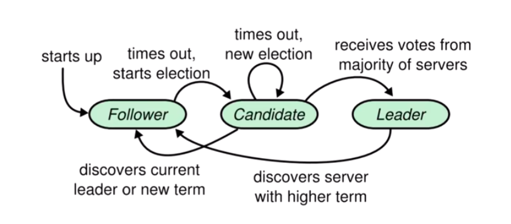

## 如下图，是一个集群成员状态机变更的详情

 

### 总览概述
raft 算法中，集群节点的角色类型分为：领导者 leader、跟随者 follower、候选人 candidate 三种角色. 
对各角色间的切换机制进行一个总览性的描述.

（1）leader -> follower

倘若 leader 发现当前系统中出现了更大的任期，则会进行“禅让”，主动退位成 follower.

这里 leader 发现更大任期的方式包括：
I 向 follower 提交日志同步请求时,从 follower 的响应参数中获得; 
II 收到了来自新任 leader 的心跳或者同步日志请求；
III 收到了任期更大的 candidate 的拉票请求.

（2）follower -> candidate

leader 需要定期向 follower 发送心跳，告知自己仍健在的消息.

倘若 follower 超过一定时长没收到 leader 心跳时，会将状态切换为 candidate ，
在当前任期的基础上加 1 作为竞选任期，发起竞选尝试补位.

（3）candidate -> follower

candidate 参与竞选过程中，出现以下两种情形时会退回 follower：

I 多数派投了反对票；

II 竞选期间，收到了任期大于等于自身竞选任期的 leader 传来的请求.

（4）candidate -> leader

candidate 投票时，倘若多数派投了赞同票，则切换为 leader.

（5）candidate -> candidate

candidate 的竞选流程有一个时间阈值. 倘若超时仍未形成有效结论（多数派赞同或拒绝），
则会维持 candidate 身份，将任期加1，发起新一轮请求投票.

### leader
领导者是写请求的统一入口，在接收到来自客户端的写请求时，会开启“两阶段提交”的流程：
（1）广播 proposal，向所有节点同步这一请求；
（2）当请求得到多数派的赞同后，才会提交这一请求.
leader 还需要周期性地向集群中所有节点发送自己的心跳，告知自己的健康状况，用途包括：
（1）让 follower 重置心跳检测定时器，避免其切换成 candidate 发起投票；
（2）在心跳请求中携带上 leader 最新已提交日志的标识 id（term + index），推动 follower 更新日志提交进度.

### Follower
follower 的职责包括如下几项：

（1）负责同步 leader 传来的写请求，此时也有一个参与民主反馈的过程，倘若同步成功，会给予 leader 正向反馈，
    当 leader 的同步请求收到半数以上的认可时，会提交日志；

（2）通过接收 leader 心跳的方式，获取到携带的 commitIndex 信息，及时完成已被多数派认可的预写日志的提交，
   以推进其写入状态机的进度. 这一项相当于做到了数据的备份，也被读请求最终一致性提供了保证;

（3）负责为参与竞选 candidate 的投票，

（4）通过心跳检测定时器时时关注 leader 的健康状态，当超时未收到心跳时，会切换为 candidate 发起竞选.

### Candidate

candidate 是一个临时态，成为 candidate 意味着此时正处于成与败的分叉路口，candidate 有关的核心流程如下：

（1）倘若 follower 切为 candidate，会将当前任期加1，作为竞选任期；

（2）会将自身的一票投给自己；

（3）广播向所有节点拉票；

（4）倘若拉票请求超时前，得到多数派认可，则上位为 leader；

（5）倘若拉票请求超时前，遭到多数派拒绝，则老实退回 follower；

（6）倘若拉票请求超时前，收到了任期大于等于自身竞选任期的 leader 的请求，则老实退回 follower；

（7）倘若拉票请求超时，则竞选任期加 1，发起新一轮竞选拉票请求.

