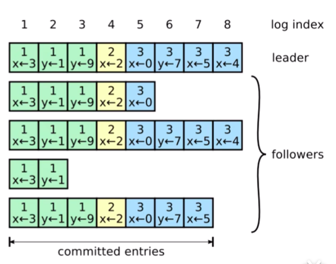
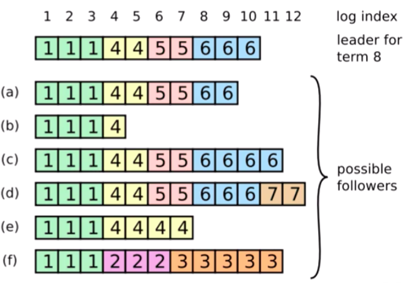
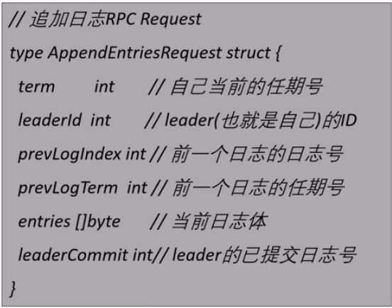
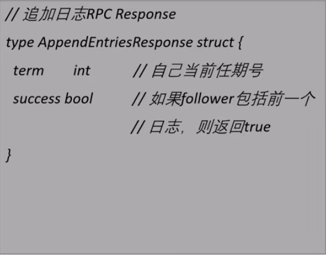

## 日志复制

Leader接收到客户端的指令后，会把指令作为一个新的条目追加到日志中去。
一个日志中包含有三个信息
* 状态机指令
* leader的任期号
* 日志号，日志索引

 

如上图，我们可以看到， 第一个指令就是 把x 复制为3
任期号：日志中的任期号，对于检测多个日志之间的副本不一致的情况和判断节点状态都有着重要的作用。
如上图，每个方块里面最上面的数字就代表的是任期号。

由于存在leader宕机的可能性，所以我们后面会看到日志号相同的日志，但是他们的内容却不同的情况
所以说，只有`日志号相同`，`任期号相同` 两个才能共同确认一个日志。

#### AppendEntries RPC
生成日志后，leader 就会把日志放到append entries rpc中，并行的发送给Follower。让他们复制日志。
当Follower复制的日志数量超过半数之后。leader就可以在本地执行命令，并把结果返回给客户端。

`本地执行命令，也就是leader提交日志，称为提交`。

 

我们再看一下这个图片，可以看到不同的Follower节点的状态是不一致的。
有的节点差掉了几个日志，有的差了几个任期。

但是在上图中，包括leader 在内，只要有三个节点复制到了日志，leader就可以提交了。
我们可以看到 图中在log index 为7的位置就是我们可以提交的日志节点，因为
超过集群半数的节点以及复制到了日志。

#### Follower 如何追上leader并保证日志是完整的
在一个分布式系统中，leader 和Follower 都有随时宕机的可能性，Raft 要有一定的机制，继续支持日志复制。
并且保证每个日志副本日志复制顺序的一致性。

> Follower缓慢
    leader 会不断地追发 AppendEntries 请求给Follower，哪怕leader已经回复了客户端
> Follower 宕机
    Follower宕机后恢复，这个时候，Raft追加日志条目的`一致性检查`生效，保证Follower能按照时间按照顺序的
    恢复崩溃后的日志。
`一致性检查`：leader 在每个发往Follower的追加条目RPC中的时候，会放置`前一个条目的索引位置和任期号，如果Follower在他的
日志中找不到前一个日志，那么他就会拒绝这个日志`，leader 收到了Follower的拒绝后，会发送前一个日志条目。
从而逐步向前定位到Follower第一个缺失的日志。
    [为什么需要一个个找]
    因为当前Follower 宕机恢复后，已经经历了很多轮选举，可能leader已经换了很多个。
    而且Follower的自己的状态也是未知的，不知道自己错过了那一轮日志，所以需要一个个找

> Leader宕机
    如果leader崩溃，那么崩溃的leader可能已经复制了日志到部分Follower，但是还没有提交。
    而新选出的leader 有可能不具备这些日志，这样就有部分的Follower的日志和新的leader不同。

`Raft 在这种情况下，会通过强制Follower复制它的日志来解决不一致问题，这意味着Follower中跟Leader
冲突的日志条目会被新的leader日志条目覆盖。（因为还没有提交，所以不影响一致性）`
即Follower中最后一个和自己一致的日志 都会被覆盖掉

 

我们来看上面的这张图，Follower中的C 和 D，竟然比上面的leader还多出了两个日志。
为什么leader中没有这些日志还可以当选leader呢，因为 c 和d中多出的日志还没有提交。
在这些7个节点的集群中，leader可以依靠 剩下的几个当选为新的leader。

我们可以看到最后一个节点f， 它具有的 `2` `3` 任期的日志别的节点都不具有。
这大概率意味着在他的那几个任期内担任leader，它的日志还没有复制到大多数节点就挂掉了。

### AppendEntry RPC

 
    
    prevLogIndex， prevLogTerm 这两个字段是用来进行一致性检查的。
    只有这两个都与Follower的相同，leader 才会认为日志是一致的。
    entries 是当前日志体。也就是命令的内容
    leaderCommit，leader已经提交的日志号。对于Follower而言接收到日志并不能立即提交。
    因为这个时候，还不能确定日志已经被复制到大部分节点。
    只有leader 已经提交这个日志，leader才会在自己的AppendEntries RPC中把这个 leaderCommit告诉
    给其他节点。
    
 

### 读请求

raft 标准模型中，客户端的读请求可以被集群中的任意节点处理，最终会取状态机中的数据进行响应.
 由于预写日志 + 二阶段提交 + 多数派原则的机制保证了被提交的日志具有”最终一致性“的语义，
 而只有被提交的日志才有资格被应用到状态机，因此状态机的数据也必然具有最终一致性，
 而无法保证即时一次性（follower 和 leader 之间的数据状态）
 
 如果要求读流程满足即时一次性的要求，则要做一些额外的处理：
 
 （1）appliedIndex 校验：每次 leader 处理写请求后，会把最晚一笔应用到状态机的日志索引 appliedIndex 反馈给客户端.
  后续客户端和 follower 交互时，会携带 appliedIndex. 
  倘若 follower 发现自身的 appliedIndex 落后于客户端的 appliedIndex，说明本机存在数据滞后，则拒绝这笔请求，
  由客户端发送到其他节点进行处理.
 

 

### 总结：
    
    > Leader 只需要正常的操作，然后日志就可以在回复AppendEntries 一致性检查失败的时候自动趋于一致。
    
    > leader 从来不会覆盖或者删除自己的日志条目。
    
    > 只要过半的节点能够正常服务，Raft就可以正常对外部提供服务。
    
    > 单个运行慢的Follower不会影响整体的服务性能

