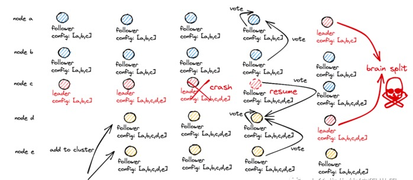

## 集群成员变更。

比如说，增加集群节点，替换宕机的机器。

对于分布式系统而言，是不可能在同一个时间对集群应用所有的变更的。这个是分布式系统天然的限制。
所以说分布式系统的变更必然会持续一段时间。

集群成员变更最大的难点是： `防止集群同时出现两个leader`，因为转换期间整个集群可能划分为两个独立的大多数。

配置变更的过程和 leader 同步日志的过程是一致的. 配置变更的请求会被包装成一条写请求，
走进两阶段提交的流程当中，有所区别的是，此时由于涉及集群节点数量的变更，
因此配置变更期间的`多数派仍以变更前的节点名单为准`，`即多数派要求的节点数量为变更前集群的节点数量，`
多数派的组成节点要求为变更前已存在于集群的老节点.

下面以集群新增节点的过程加以说明：

（1）配置变更请求需要由 leader 统一收口处理；

（2）leader 发起提议（proposal），将”配置变更“的日志广播给集群中的所有节点. 
配置变更的明细参数形如 ${变更前集群的节点名单}_${新加入的集群节点名单}，
`需要能明确标识出哪些节点是原有的老节点，哪些节点是新加入的节点；`
（3）当配置变更的提议要被`老节点中的多数派认可时`，leader 才会提交（commit）配置变更动作，
    在配置参数中将新老两部分节点的名单合并到一起；
（4）在配置变更期间，leader 选举时，需要获得`老节点中多数派的赞同票`，才能当选；
（5）配置变更期间，处理写请求时，需要在提议阶段获得`老节点中多数派的认可，才能进行提交`.

集群成员变更期间，如果不是获得多数老节点的认可，会发生什么bad-case

### bad-case

 

I moment1：客户端向 leader c 提交配置变更请求{abc-de}；

II moment2：leader c 广播发起提议{abc-de}，
由于 c、d、e 3 个节点都对配置变更达成认可，形成多数派，于是 leader 提交配置变更请求；
（此时 a、b 由于网络原因，还未同步配置变更，仍持有老的节点配置信息：a、b、c）

III moment3：leader c 宕机；

IV moment4：a、b 心跳检测超时，a 率先发起竞选，并且获得 a、b 两个节点的选票. 
由于 a 和 b 此时持有老的节点信息，因此认为 2 个节点即为多数派，因此 a 成功上任；
同时，节点 d 也发起竞选，获得了 d、e 以及刚从宕机中恢复的节点 c 的选票，获得了 5 个节点下的多数派

票数：3票，也成功当选；

V moment5：集群中出现两个 leader：a 和 d，发生脑裂.

① 倘若第 II 步中，leader c 仍在配置变更请求{abc-de}被同步到 c、d、e 后宕机. 
那么在新一轮选举中，d、e就无法当选，因为无法获得旧节点{abc}中的多数派认可
（a、b此时由于未同步配置，因此压根不认可d、e的身份），
因此只有 a、b 可能当选，配置变更的请求会被作废. 但由于 leader c 同步配置变更的提议也未被{abc}中的多数派认可，
因此无法提交，也不能给客户端响应. 最终形成的局面就是，
本轮配置变更请求作废，客户端在超时未得到 ack 后，会重新发起一次 d、e 加入集群的配置变更请求；

② 倘若第 II 步中，leader c 的配置变更请求{abc-de}已经得到 b 的认可，
那么 bc 会形成旧节点{abc}中的多数派；leader c 可以直接提交该笔请求. 接下来，即便 leader c 宕机了，
在{ab}中，b 会由于预写日志数据更新而胜出成为下一任 leader，那么后续请求{abc-de}会有 b 代替完成. 
因此配置变更请求{abc-de}在{abc}中形成多数派认可的那一刻，就已经成功了.

