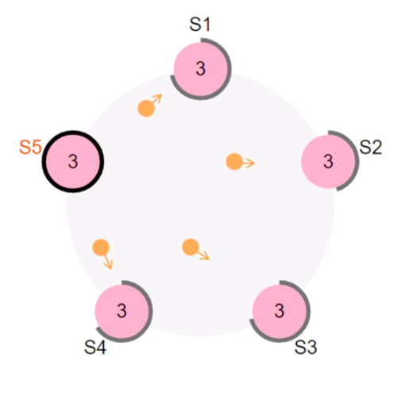
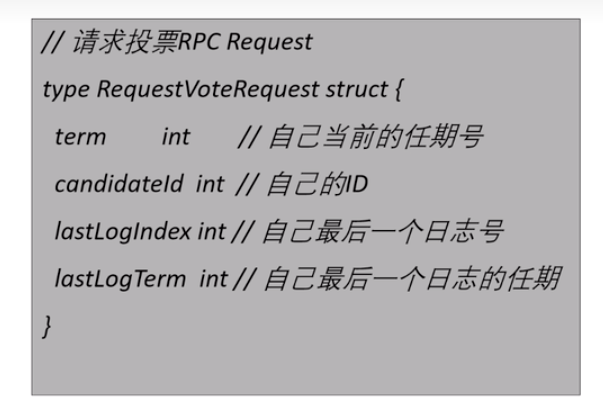
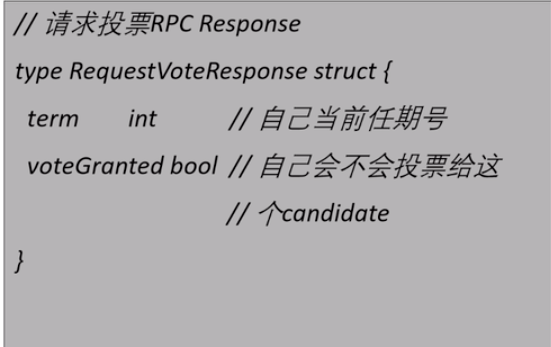

## 领导者选举

### Raft 心跳机制
如果存在leader，那么leader 就会周期性的向他的Follower 发送心跳。用来维持自己的地位。
如果Follower有一段时间没有收到心跳，那么太就会认为系统中没有可用的leader了，然后就会开始进行选举。

#### 开始一段新的选举：
（1）开始一段选举之后，Follower会先增加自己的当前的任期号，并切换到Candidate状态，然后投票给自己，
并并行向集群的其他的节点发送投票请求。即RequestVote RPC

#### 可能的结果
> 1 他获得半数选票赢得了选举，成为新的主并开始发送心跳
> 2 其他的节点赢得了选举 ——> 当前节点收到了leader的心跳之后，如果新leader的任期号不小于自己的任期号，
    那么就从Candidate 状态切换为Follower状态。
> 3 一段时间内没有任何的获胜者，每个candidate 都在自己的一个随机选举时间之后增加任期号，然后开始一个新的投票。
    当前选举阶段没有选出新的leader， 这个状态不需要有什么共识。
    而是说集群中的每个节点在等待一个超时时间之后，默认会进入下一轮选举。

#### RequestVote RPC

Request 由Candidate 发起

Resp 由Follower 回复candidate

可以看到请求和响应 都带有当前任期号，因为Raft的节点中需要通过任期号来确定自身状态
以及判断自己是否接受当前的Rpc请求。
CandidateId 表示的是当candidate 需要告诉Follower给自己投票

`lastLogIndex` 和 `lastLogTerm` 自己的最后一个日志号和自己的最后一个日志的任期号，在安全性和极端问题需要用到。

Follower 的Resp 和投票逻辑。
> Resp 比较简单，只需要告诉candidate 自己是否给这个candidate投票即可。

> 投票逻辑：
    收到一个RequestVote RPC的时候，需要校验这个candidateId是否符合条件。
    （1）请求的Term 是否大于等于自己
    （2）第二个就是后面的两个字段`lastLogIndex` 和 `lastLogTerm`
    （3）每个Follower 只有一张选票，按照先来先得的方式投票

#### leader 被选举出来之后
客户端如何之后新的leader是哪个节点呢？
（1）客户端随机向一个节点发送请求这个节点正好为leader
（2）这个节点为Follower，Follower可以通过心跳知道Leader的节点，客户端向leader发起请求
（3）找到的这个节点宕机了，那么client只能重新请求，因为集群中只要超过半数的节点存在，Raft集群就可以
    正常的对外部提供服务
    

