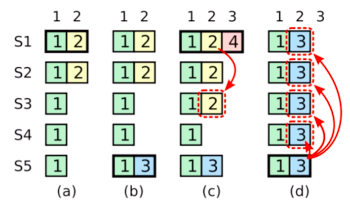

## 极端问题1：

    `领导者选举和日志复制已经包含了Raft的全程，但是这两个内容无法解释各种各样极端的情况，
    也无法保证集群的所有状态机都按照相同的顺序执行`
   
 如果Leader宕机，这个时候新的leader如何处理这些不正常的日志，是非常关键的。
 
 ### Leader宕机处理： 【选举限制】。
 
   >  如果一个Follower 落后了leader若干条日志(`但是没有遗漏整一个任期`)，那么这个时候，进行下一次选举的话。
    按照之前的规则，Follower把自己的任期号加一，他依旧有可能当选为leader。
    那么新当选的leader 就永远也无法弥补上之前的日志，从而造成状态机的不一致。
  
   >  所以需要对领导者选举增加一个限制。保证被选举出来的leader 
        `一定是包含了之前各个任期内所有的提交的日志条目`。
      

### Raft rhino如何实现这个选举限制的呢？

如上图，在RequestVote RPC中，主要是依靠后面的两个字段，
`lastLogIndex` 和 `lastLogTerm`

RPC中包含了candidate的信息，如果投票者(Follower) `自己的日志比candidate的还要更新`，
那么他会拒绝改投票请求。

`如何定义新这个概念：`
Raft 通过比较两个日志中，最后一个索引值和任期号来定义谁的日志比较新。
    `(1) 如果最后两份日志任期号不同， 那么任期号大的日志更新`
    `(2) 如果最后两份日志任期号相同，那么日志较长的那个更新`
  
  

如上图，

    
    > （a） 中，s1是leader，
    
    >  到了（b）中，s1崩溃了，s5通过s3和s4的选票赢得选举成为新的leader。
    但是到了(c)中，s5又崩溃了，这个时候，s1重启，并且成为新的leader。此时，日志2已经被复制到了大部分的机器。
    但是还没有被`提交`.
    > 到了（d）中，s1再次崩溃，s5 通过s2，s3，s4的选票再次成为leader。
        为什么s3，s4会投票给s5呢，因为他们的任期号相同，但是s5的任期号更大。
 
    注意在c中，日志已经被复制到了大部分节点。
 
### leader宕机处理：新的leader 是否提交之前任期内的日志条目。
    一旦当前任期内的某个日志条目已经存储到了过半的服务器节点上，leader就知道该日志条目可以被提交了。
  
  `提交`： 单点提交和集群提交。
  当leader 已经提交了某个日志之后， 在AppendEntries RPC中，就会存在一个 leaderCommit的字段。
  通过这个参数，Follower可以知道leader提交到了哪一个日志。
  不需要等到下一个日志过来的时候，Follower才知道提交什么日志。
  
### Raft 心跳。
    Raft的心跳也是一种特殊的AppendEntries RPC，相比较普通的AppendEntries RPC，心跳中的
    RPC，没有日志体。但是仍然可以传递leaderCommit参数， 从而可以告诉Follower 什么commit 可以提交。
 

### 问题:
    如果在Raft的leader 提交到状态机之后，直接返回给client 这个时候，Follower还没有来得及
    提交的时候，Leader宕机了，这个时候，需要怎么处理呢？
    通常情况下，会设置一个集群提交的概念。
    比如说，当leader和集群中大部分节点以及提交到了状态机之后。在向client返回以及提交。
   

  

   如果某个leader 在提交某个日志前崩溃了，以后的leader 会试图完成这个日志条目的`复制`。
  这个地方要注意，是复制，而不是提交。
    
    
  
 

