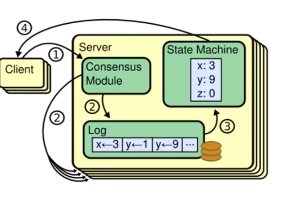
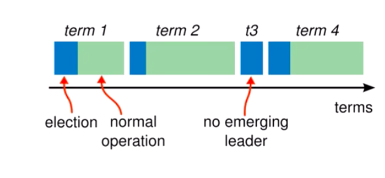

## 复制状态机

`相同的初始状态 + 相同的输入 = 相同的结束状态`

可以简单的理解为，在多个节点上面，从相同的初始状态开始，执行相同的一串命令，一定会产生相同的状态。
在Raft中，Leader 将客户端的请求（command）封装到一个个的log entry中去。
然后将这些Log Entry复制到所有的Follower节点。
然后大家按照相同的顺序应用Log Entry中的Command，根据复制状态机的理论，最后大家的状态肯定是一致的。

一个分布式场景下的各个节点间，就是通过共识算法来保证命令序列的一致，从而自始至终保证他们的状态一致，
从而实现高可用。

## 状态简化

如上图，在任何时刻，每个服务器中的每个节点都处于leader，follower或者candidate这三者的状态之一。
Raft只需要考虑状态之间的切换，不需要考虑状态之间的共存和影响。

任何一个节点，启动的时候，都是一个follower节点。当他察觉到集群中没有leader的话，他会把自己从leader状态切换为
candidate状态。如果选举成功，它会切换为Leader状态，否则如果有其他节点变成了Leader的话，
他自己会回到Follower状态。
如果一个leader 宕机，或者开始了下一次选举，它会将自己切换为Follower状态。

如上图，Raft把时间分割为了任意长度的任期(term)，任期使用连续的整数标记。
每一段任期从一段选举开始，在极端情况下，一次选举无法选出leader，比如说两个节点获得了相同的票数。
在这种情况下，这一个任期会以没有Leader的状态结束。会重新开启一个新的任期。重新开启一个新的选举。
Raft需要保证任意的一个任期内，最多只有一个leader。

通过任期的比较，可以帮助我们确认一台服务器的历史状态。
比如说我们可以查看服务器是否具有某一个任期的日志，来判断某一个节点在某个任期内是否宕机。

## 通信
Raft之间的服务器节点间使用RPC进行通信。并且Raft节点之间只有两种简单的Rpc。
> (1) RequestVote Rpc (请求投票) 由candidate在选举期间发起。
> (2) AppendEntries Rpc (追加条目) 由leader发起用来复制日志和提供一种心跳机制。
Raft 在Rpc之上附加了很多功能
  > 比如说 服务器之间通信的时候，会交换任期号，如果一个服务器上当前的任期号比其他的小。
    该服务器会将自己的任期号更换为较大的那个值。
  > 如果一个candidate 或者leader 发现自己的任期号过期了，即自己的任期号比较小。
    就会立刻切换为Follower状态 
  > 如果一个节点接收到一个包含过期任期号的请求，它会直接拒绝这个请求。

 

